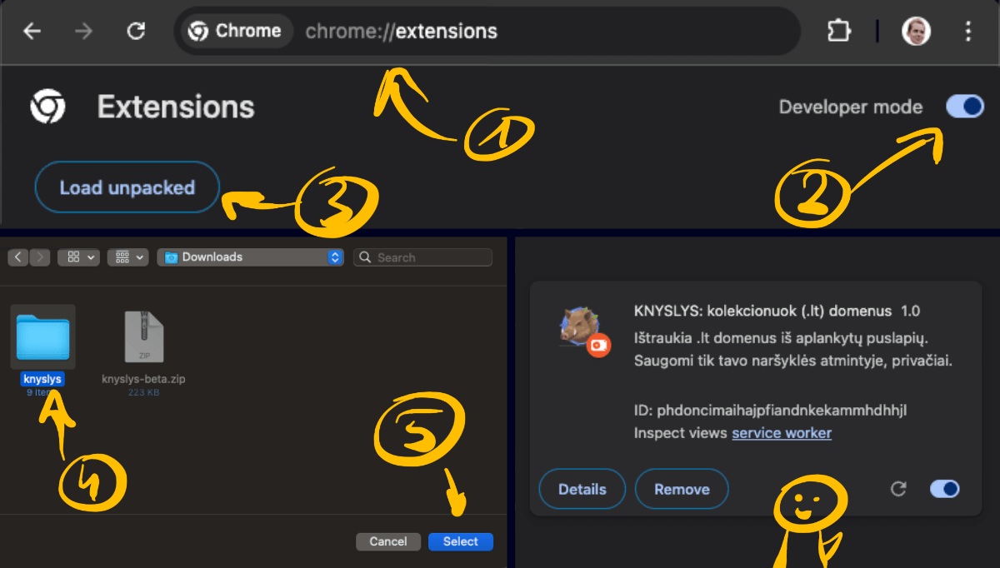
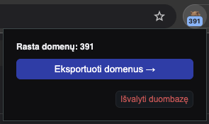

# Knyslys: collect .lt domains

A small browser extension that collects `.lt` domains you see while browsing. The list is stored locally in your browser.

## Works In
- Chromium-based browsers: Google Chrome, Microsoft Edge, Brave, Vivaldi, Opera

## Install (Developer Mode)
1. Download or clone this repository.
2. Open the extensions page:
   - Chrome/Brave/Vivaldi/Opera: **chrome://extensions**
   - Edge: **edge://extensions**
3. Turn on "Developer mode".
4. Click "Load unpacked" and select this folder.

Like this:

## Use
- Browse as usual. The extension automatically finds `.lt` domains on pages you visit.
- Open the toolbar popup to see the count.
- Download domains: in the popup, click "Export" to save a `.txt` file.
- Delete collected domains: in the popup, click "Clear" and confirm.

Like this:

## Privacy
- All domain data is stored using your browser's local storage API. It stays on your device.
- Nothing is uploaded to any server. No tracking, no analytics, no external connections.
- The extension works completely offline after installation.
- Browser permissions used: storage (to save domains locally), tabs (to read page content), downloads (to export your list), and access to all sites (to detect `.lt` domains).
- It doesn't track anything on these sites: facebook.com, messenger.com, instagram.com, x.com, linkedin.com, tiktok.com, youtube.com, gmail.com, mail.google.com, outlook.com, live.com.

## License
- Unlicense, do whatever — see https://unlicense.org/